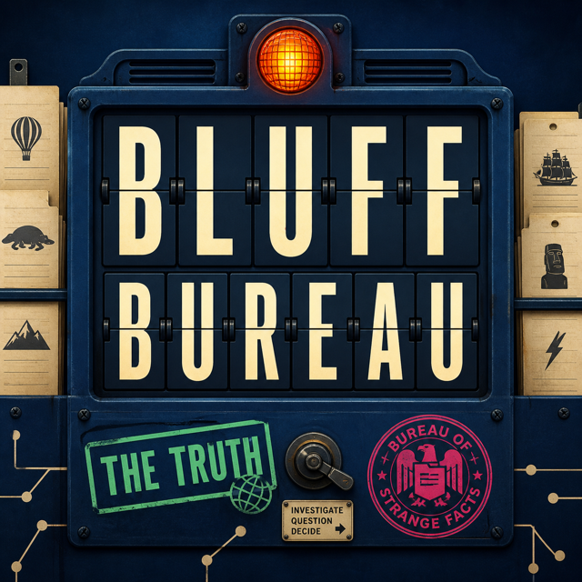

# Bluff Bureau

Bluff Bureau is a 3–8 player social bluffing game for [Toilet Paper Games](https://play.tp.games). Players file plausible lies for strange factual prompts, vote for the truth, and choose whether to risk a **Certain** 2× confidence stake.



## How a game works

1. The room director starts from their controller; the shared host never contains controls.
2. Everyone writes one private bluff for the current case file.
3. The truth and accepted bluffs are shuffled onto the public board.
4. Each controller votes privately and chooses **Sure** or **Certain**.
5. Correct votes earn 1,000 points. Bluff writers earn 500 points per fooled player. A **Certain** vote doubles either outcome, and the fourth-file finale doubles the whole round.

The game includes lobby, instructions, writing, confirmed waiting, voting, results, round break, finale, game-over, reconnecting, spectator, minimum-player, and eight-player states.

## Architecture

```text
src/domain/          pure rules, validation, transitions, scoring
src/application/     coordinator and injected runtime/clock/random/content ports
src/platform/        thin @tpgames/game-kit adapter and surface bootstrap
src/presentation/    host, spectator, and controller renderers
src/testing/         deterministic fixtures, runtime fake, and scenario harness
surfaces/            independent bundle entry documents
```

Canonical phase, public choices, results, and scores live in authority-owned shared state. Private bluff and vote intents use per-player state and become confirmed only when the authority echoes a matching receipt into shared state. The host and spectator only render public state.

## Develop

```bash
npm install
npm run dev
```

Open the synchronized TPG workbench at `http://127.0.0.1:5173/__tpg/workbench`.

The deterministic scenario gallery supports direct links to every surface and state:

```text
http://127.0.0.1:5173/gallery.html?surface=host&scenario=results
http://127.0.0.1:5173/gallery.html?surface=controller&scenario=voting&player=p2
http://127.0.0.1:5173/gallery.html?surface=spectator&scenario=game-over
```

Scenarios: `loading`, `lobby`, `min-lobby`, `max-lobby`, `instructions`, `writing`, `voting`, `max-voting`, `results`, `max-results`, `round-break`, `game-over`, and `reconnecting`. Use `player=p1` for the authority controller or another player id for a non-authority view.

## Verify

```bash
npm run typecheck
npm test
npm run test:e2e
npm run validate
```

`npm run test:e2e` launches one host and three real controller iframes, plays every action across all four files, verifies final standings and host passivity, then exercises reconnect and authority transfer. It records a video and trace. A checked-in run is available at [docs/evidence/full-game-playthrough.webm](docs/evidence/full-game-playthrough.webm).

`npm run validate` runs the TPG boundary/capability checks, builds the exact registry archive, and validates its strict manifest and bundle-relative files through the package API. The resulting archive is `dist/bluff-bureau-0.2.4.zip` and is intentionally ignored by Git. The manifest’s controller-only playable topology and passive-host tag record the public-display contract until the merged `displayInteraction` schema ships in the public author packages ([platform issue](https://github.com/Toilet-Paper-Games/Toilet-Paper-Games/issues/930)).

## Publish

```bash
npm exec -- tpgames whoami
npm run publish:dry-run
npm run publish:game
```

The production registry is the default. Browser login is available through `npm exec -- tpgames login`; unattended publishing uses a secret-injected `TPG_API_KEY` and never stores credentials in the repository.

## Design and product records

- [PRODUCT.md](PRODUCT.md) — product contract and constraints
- [docs/game-design.md](docs/game-design.md) — rules and scoring
- [docs/design-artifacts.md](docs/design-artifacts.md) — visual direction, north-star states, and design evidence
- [docs/production-verification.md](docs/production-verification.md) — published version, fresh-room journey, and release evidence
- [docs/developer-experience.md](docs/developer-experience.md) — platform authoring journal

The trivia library in `src/application/content.ts` keeps an authoritative source label and URL with every case file; sources are revealed with each answer.
